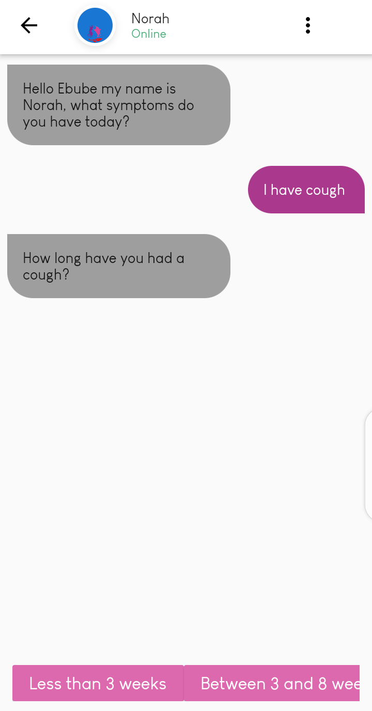
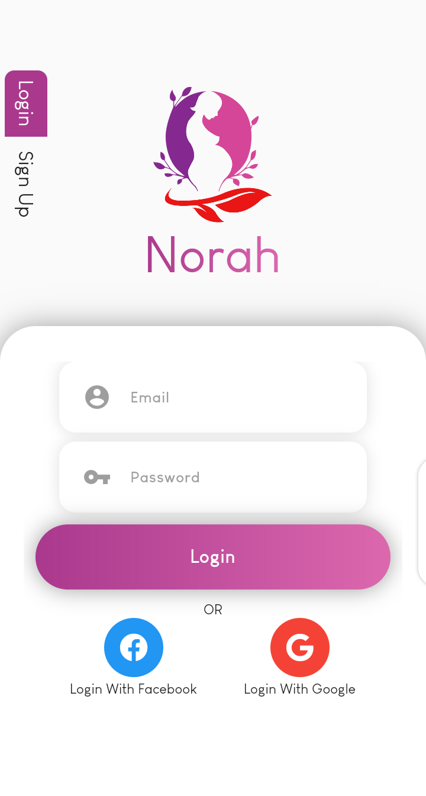
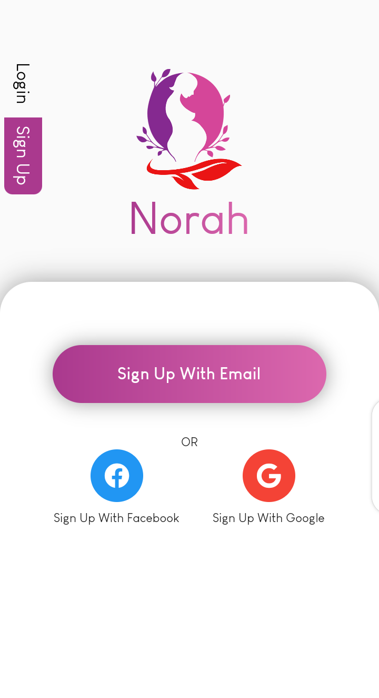
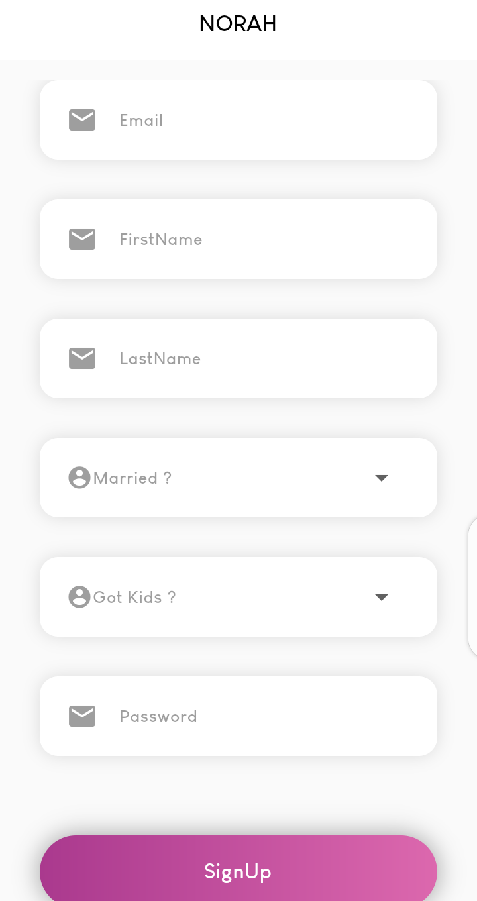

# 📖📖 Norah 

A Flutter app that connects people to doctors(still in development).

## 💻 Requirements
* Any Operating System (ie. MacOS X, Linux, Windows)
* Any IDE with Flutter SDK installed (ie. IntelliJ, Android Studio, VSCode etc)
* A little knowledge of Dart and Flutter

## ✨ Features
- [x] Chatbot.
- [x] Voice call, coming soon.
- [x] Video call, coming soon.

## 📸 ScreenShots

  
 

## 🔌 Plugins
| Name | Usage |
|------|-------|
|[**Provider**](https://pub.dev/packages/provider)| State Management|
|[**DIO**](https://pub.dev/packages/dio)| Network calls and File Download|
|[**HIVE**](https://pub.dev/packages/hive)| Local storage|

## 🤓 Author(s)
**Okocha Ebube**

## 🔖 LICENCE
[Apache-2.0]